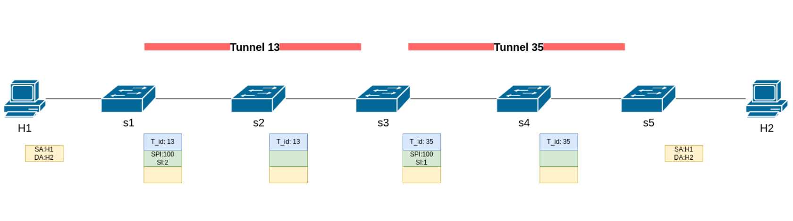

# Packet Forwarding with NSH in SFC Architecture - P4 in Kathara

In this project it is implemented a P4 program that instructs switches to perform packet forwarding according to the **Service Function Chain (SFC)** architecture, based on the **Network Service Header (NSH)**. With reference to the SFC architecture, the Classifier (CL) and the Service Function Forwarder (SFF) are been implemented.

## Requirements 

To run this project you need to have Kathara, which is a network emulation tool for testing complex network scenarios (based on docker).
Here it is the [installation Kathara page](https://github.com/KatharaFramework/Kathara/wiki).

## Topology

Let us consider the scenario reported in the figure below, showing an SFC domain connecting two hosts. 



The traffic generated by host H1 and directed to host H2 must be steered through two Service Functions (not shown in the figure because we want to learn the forwarding of the packets): 
- the first one is connected to the switch s3
- the second is accessible through the switch s5 
The two switches then assume the role of SFFs.

In order to steer the traffic through the forementioned service chain, the switch s1 inserts in every packet destined to H2 an NSH having an SPI=100 and initializing the SI=2. It is then acting as a CL. 

The different elements of the SFC architecture are interconnected by pre-configured tunnels.

In particular, the switches s2 and s4 are transparent to the SFC overlay, thus they forward the traffic only looking at the tunnel header. 

Finally, the traffic from H2 to H1 is simply forwarded according to the IPv4 data plane.

## Implementation of the Lab

In the Lab folder, it is possible to look at the implementation of the situation described above. I will present the logic of the code and the process of sending and receiving packets between two hosts, h1 and h2, through a series of intermediate steps performed by the intermediary devices s1, s2, s3, s4, and s5:

- **h1:**
  - Sends a packet to h2.

- **s1 (Service Classifier):**
  - Receives the packet.
  - Using the destination IP address as a key, adds the NSH header with SPI/SI (100 2).
  - Using SPI/SI (100 2) as a key, encapsulates the packet in the tunnel header with ID 13 and forwards it to port 2.

- **s2:**
  - Receives the packet.
  - Using the tunnel ID (13) as a key, forwards it to port 2.

- **s3 (1st Service Function Forwarder):**
  - Receives the packet.
  - Using the tunnel ID (13) as a key, removes the tunnel header.
  - Using SPI/SI (100 2) as a key, decrements SI by 1, encapsulates in the tunnel header with ID 35, and forwards it to port 2.

- **s4:**
  - Receives the packet.
  - Using the tunnel ID (35) as a key, forwards it to port 2.

- **s5 (2nd Service Function Forwarder):**
  - Receives the packet.
  - Using the tunnel ID (35) as a key, removes the tunnel header.
  - Using SPI/SI (100 1) as a key, decrements SI by 1, removes the NSH header, forwards it to port 2, and decrements the TTL of IPv4.

- **h2 (Host 2):**
  - Receives the packet.

The order of the encapsulation is: ethernet header, tunnel header, NSH header and IPV4 packet.

**Note**: All the processing is done in the ingress pipeline for simplicity, usually it would be better to remove the headers in the ingress pipeline and then add the new headers in the egress pipeline.


## Testing the Lab

To run the lab and see what it is happening, I have provided two python programs that allow you to send and receive packets between `h1` and `h2`.

Open a terminal in the same folder of the lab, launch in the main terminal:
```
kathara lstart
``` 

Launch in the `h2` terminal:
```
python receiver.py
``` 

Then, launch in the `h1` terminal: 
```
python server.py 10.0.0.2 "Ciao"
```

You will obtain in `h1` terminal: 
```
Packet sent on interface eth0 to 10.0.0.2 with message <Ciao>
```

You will obtain in `h2` terminal: 
```
sniffing on interface eth0
Got a Packet ! ! !
###[ Ethernet ]### 
  dst       = 00:00:00:00:00:22
  src       = 00:00:00:00:00:11
  type      = IPv4
###[ IP ]### 
     version   = 4
     ihl       = 5
     tos       = 0x0
     len       = 24
     id        = 1
     flags     = 
     frag      = 0
     ttl       = 63
     proto     = hopopt
     chksum    = 0x67e3
     src       = 10.0.0.1
     dst       = 10.0.0.2
     \options   \
###[ Raw ]### 
        load      = 'ciao'
###[ Padding ]### 
           load      = '\x00\x00\x00\x00E\x00\x00\x18\x00\x01\x00\x00?\x00\x00\x00\x00\x00\x00\x00\x00\x00'
```

There is another way to see the exchange of the packet.

Launch in the `h2` terminal:
```
tcpdump
``` 

Then, launch in the `h1` terminal:
```
ping 10.0.0.2
```

You will obtain in `h1` terminal: 
```
ping 10.0.0.2
PING 10.0.0.2 (10.0.0.2) 56(84) bytes of data.
64 bytes from 10.0.0.2: icmp_seq=1 ttl=59 time=11.6 ms
64 bytes from 10.0.0.2: icmp_seq=2 ttl=59 time=12.1 ms
^C
--- 10.0.0.2 ping statistics ---
2 packets transmitted, 2 received, 0% packet loss, time 1002ms
rtt min/avg/max/mdev = 11.643/11.860/12.077/0.217 ms
```

You will obtain in `h2` terminal: 
```
tcpdump: verbose output suppressed, use -v[v]... for full protocol decode
listening on eth0, link-type EN10MB (Ethernet), snapshot length 262144 bytes
12:23:31.135035 IP 10.0.0.1 > 10.0.0.2: ICMP echo request, id 2, seq 1, length 64
12:23:31.135097 IP 10.0.0.2 > 10.0.0.1: ICMP echo reply, id 2, seq 1, length 64
12:23:32.136727 IP 10.0.0.1 > 10.0.0.2: ICMP echo request, id 2, seq 2, length 64
12:23:32.136773 IP 10.0.0.2 > 10.0.0.1: ICMP echo reply, id 2, seq 2, length 64
```

In the shared folder, there are some pcap files. These files are some Wireshark Captures that show the correct implementation of the forwarding. There are two packets in every capture: the first is the interesting one and I will discuss about this, while the second is a common ICMP packet.
- s1 in eth0 interface: s1 receives the packet; the packet has 480 bits that is the size of the IPV4 packet.
- s1 in eth1 interface: s1 adds the tunnel header(32 bits) and the NSH header(40 bits); so the packet has 552 bits that is the size of the IPV4 packet plus the headers.
- s2 in eth0/eth1 interface: s2 only forwards the packet to s3; the packet has 552 bits.
- s3 in eth0/eth1 interface: s3 removes the tunnel headers, decrements the SI and then adds a new tunnel header; the packet has 552 bits.
- s4 in eth0/eth1 interface: s4 only forwards the packet to s5; the packet has 552 bits; the packet has 552 bits.
- s5 in eth0 interface: s5 receives the packet; the packet has 552 bits.
- s5 in eth1 interface: s5 removes the tunnel headers and the NSH headers; so the packet has 480 bits again.

You can do the same captures launching the ```tcpdump``` command in every xterm (before doing the ping between `h1` and `h2`).

Close the lab with:
```
kathara lclean
```


